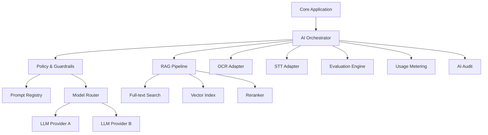

# VWork – AI Architecture v1.0

**Phạm vi:** Kiến trúc AI cho VWork Core v1  
**Nguyên tắc:** AI hỗ trợ công việc, không phải nguồn thẩm quyền; mọi AI output quan trọng phải grounded, có provenance và human review.

---

# 1. Mục tiêu

AI Platform của VWork phải:
- hỗ trợ nhiều provider/model.
- không khóa business service vào vendor.
- kiểm soát tenant/data scope.
- hỗ trợ RAG có citation.
- hỗ trợ OCR/STT.
- quản lý prompt version.
- có evaluation framework.
- có guardrails.
- đo usage/cost/latency.
- fallback/degrade khi provider lỗi.
- audit mọi AI run quan trọng.

---

# 2. Logical Architecture



---

# 3. AI Use Case Classes

## AI-UC-A – Extraction
- classification
- metadata extraction
- task/deadline extraction
- metric extraction

Output ưu tiên structured JSON + schema validation.

## AI-UC-B – Generation
- draft document
- response package
- report narrative
- meeting minutes

Grounded generation bắt buộc khi source tồn tại.

## AI-UC-C – Review
- logic
- missing content
- consistency
- rule/compliance findings
- rewrite

## AI-UC-D – Conversational RAG
- Ask VWork
- knowledge Q&A
- executive Q&A

## AI-UC-E – Executive Intelligence
- brief
- signals
- risk explanation

## AI-UC-F – Speech/OCR
- OCR
- STT
- diarization

---

# 4. AI Request Envelope

Mọi AI request nội bộ phải có:
- aiRunId
- tenantId
- membershipId/systemActor
- useCaseCode
- dataScopeSnapshot
- sourceRefs
- promptTemplateId
- promptVersion
- policyVersion
- modelCapability
- outputSchema optional
- correlationId
- sensitivityClassification
- maxCost/latency budget optional

Không cho client tự truyền tenantId làm nguồn authoritative.

---

# 5. AI Response Envelope

- aiRunId
- status
- provider
- model
- promptVersion
- output
- structuredOutput
- citations[]
- groundingSummary
- safetyFlags[]
- usage
- latency
- finishReason
- errorCode

---

# 6. Prompt Registry

Entity:
PromptTemplate → PromptVersion.

Mỗi prompt version lưu:
- use case.
- system instruction.
- input contract.
- output schema.
- policy references.
- examples.
- prohibited behavior.
- effective date.
- owner.
- evaluation baseline.

Prompt published immutable; sửa tạo version mới.

---

# 7. Model/Provider Registry

Provider:
- capabilities
- regions
- data policy
- auth secret ref
- rate limit
- cost profile
- status

Model:
- capability tags: CHAT, JSON, VISION, EMBEDDING, OCR, STT.
- max context.
- latency class.
- quality tier.
- data residency notes.
- enabled use cases.

Business use case chỉ request capability/tier; Router chọn model.

---

# 8. Model Routing

Input:
- use case
- sensitivity
- required capability
- tenant policy
- quality tier
- latency budget
- cost budget
- provider availability

Routing output:
- primary model
- fallback model(s)

Hard constraints áp trước scoring.

Không route restricted data tới provider bị tenant policy cấm.

---

# 9. RAG Pipeline

```text
Query
→ Auth context
→ Query rewrite optional
→ Scope filter
→ Hybrid retrieval
→ Metadata filtering
→ Rerank
→ Evidence set
→ Sufficiency check
→ Prompt assembly
→ LLM generation
→ Citation mapping
→ Groundedness check
→ Answer
```

Scope filter phải xảy ra trước khi content được đưa vào LLM.

---

# 10. Knowledge Ingestion

Source publish:
1. permission validation.
2. malware/content parse.
3. normalize.
4. chunk.
5. metadata enrichment.
6. access scope tag.
7. embed/index.
8. quality check.
9. publish index version.

Chunk metadata:
- tenant
- source id/version
- document version
- page/section
- taxonomy
- access scope
- classification
- checksum

---

# 11. Chunking Strategy

Không dùng một chunk size cố định cho mọi loại.

Document:
- theo heading/paragraph.
- table giữ row/column context.
- legal/reference docs giữ article/section unit.
- report giữ section + table separately.

Overlap chỉ dùng khi cần continuity.

Chunk ID phải deterministic theo source version + segment để hỗ trợ reindex.

---

# 12. Retrieval

Baseline hybrid:
- BM25/full-text.
- vector similarity.
- metadata filters.
- reranking.

Query types:
- exact fact → ưu tiên lexical.
- semantic → hybrid.
- status/work query → ưu tiên structured DB, không dùng RAG thay database.

VWork Assistant phải biết chọn Structured Query vs RAG.

---

# 13. Grounding Model

Mỗi claim quan trọng:
- FACT: có source.
- INFERENCE: suy luận từ source.
- MISSING: thiếu thông tin.

Câu trả lời có thể gồm nhiều claim với provenance khác nhau.

Nếu evidence insufficient:
- abstain.
- yêu cầu bổ sung.
- không fabricate.

---

# 14. Citation

Citation canonical:
- source type
- source id/version
- page/section/table/cell/timestamp
- excerpt hash
- relevance score

UI click citation phải mở đúng source version.

---

# 15. Structured Output

Use cases extraction/report schema/task extraction phải dùng JSON schema khi provider hỗ trợ.

Flow:
LLM output → schema validator → repair/retry bounded → fail explicit.

Không parse tự do nếu output dùng làm command/state change.

---

# 16. Guardrails

Pre-input:
- tenant scope.
- file safety.
- prompt injection heuristic.
- PII/sensitivity policy.
- size/token limits.

Prompt:
- system policy.
- tool allowlist.
- deny unsupported action.

Post-output:
- schema validation.
- prohibited content/policy.
- citation check.
- groundedness.
- sensitive leakage.
- business rule validation.

---

# 17. Prompt Injection Defense

Treat source documents as data, not instructions.

Controls:
- delimiter/source wrapping.
- system instruction priority.
- block external instruction execution.
- tool calls require allowlist and authz.
- retrieval source trust level.
- suspicious instruction detection.
- red-team evaluation.

---

# 18. AI Tool Use

Core v1 tool actions:
- search authorized knowledge.
- fetch document metadata.
- fetch work/task/report status.

AI không được tự:
- approve.
- assign.
- send/publish.
- delete.
- change workflow.

AI có thể suggest action; user initiates official command and backend re-authorizes.

---

# 19. Evaluation Framework

Metrics theo use case:

Extraction:
- precision/recall/F1.
- field exact match.
- deadline accuracy.
- provenance accuracy.

RAG:
- retrieval recall.
- citation correctness.
- groundedness.
- answer completeness.
- abstention accuracy.

Generation:
- factual consistency.
- required section coverage.
- template adherence.
- style.
- hallucination rate.

Review:
- finding precision.
- blocker recall.
- false-positive rate.

STT/OCR:
- WER/CER.
- table extraction accuracy.
- confidence calibration.

---

# 20. Evaluation Dataset

Mỗi P0 AI use case có dataset:
- representative.
- sanitized/anonymized nếu cần.
- versioned.
- expected output.
- edge cases.
- negative/adversarial cases.

Không dùng production data trực tiếp nếu chưa được phê duyệt.

---

# 21. Quality Gates

Model/prompt mới chỉ promote khi:
- không giảm metric critical quá threshold.
- cross-tenant/safety tests PASS.
- groundedness PASS.
- latency/cost trong budget.
- regression suite PASS.

---

# 22. Hallucination Controls

- structured query cho factual status.
- RAG grounding.
- source citation.
- FACT/INFERENCE/MISSING.
- temperature policy thấp cho extraction.
- deterministic calculator/rule engine cho số liệu.
- human review.
- abstention.

---

# 23. OCR Architecture

OCR pipeline:
upload → image normalization → page detection → OCR → layout/table extraction → confidence → low-confidence review → structured text.

OCR không ghi đè file gốc.

---

# 24. STT Architecture

audio → normalize codec/sample → chunk/stream → STT → diarization → merge → transcript segments → confidence → review.

Mỗi transcript segment có timecode.

---

# 25. AI Job Lifecycle

QUEUED → RUNNING → SUCCEEDED / RETRYING / FAILED / DEAD_LETTER.

Retry:
- provider timeout/429/5xx.
Không retry:
- invalid schema input.
- permission.
- blocked policy.

---

# 26. AI Usage Metering

Theo:
- tenant
- use case
- provider/model
- input/output units
- latency
- status
- estimated cost

Quota policy:
- warn threshold.
- hard cap optional.
- fallback lower-cost model optional.

---

# 27. Privacy & Data Handling

Provider policy per tenant:
- allowed providers.
- data region.
- training retention opt-out requirement nếu có.
- sensitive class handling.
- max payload.

Không log full prompt/output trong plaintext nếu chứa restricted data; lưu secure reference/redacted audit.

---

# 28. AI Failure Modes

Provider unavailable:
- fallback.
- retry.
- explicit UI failure.

Insufficient evidence:
- no hallucinated answer.

Schema fail:
- bounded repair then fail.

Quota exhausted:
- quota error hoặc fallback policy.

RAG unavailable:
- do not claim grounded response.

---

# 29. AI Observability

Metrics:
- calls.
- latency p50/p95.
- error rate.
- token/units.
- cost proxy.
- fallback count.
- grounding failure.
- citation count.
- evaluation drift.

---

# 30. AI Exit Criteria

- P0 use cases có prompt/model policy.
- evaluation dataset.
- guardrails.
- provider abstraction.
- audit.
- usage metering.
- citation/provenance.
- failure/degrade mode.
- human review gate.
