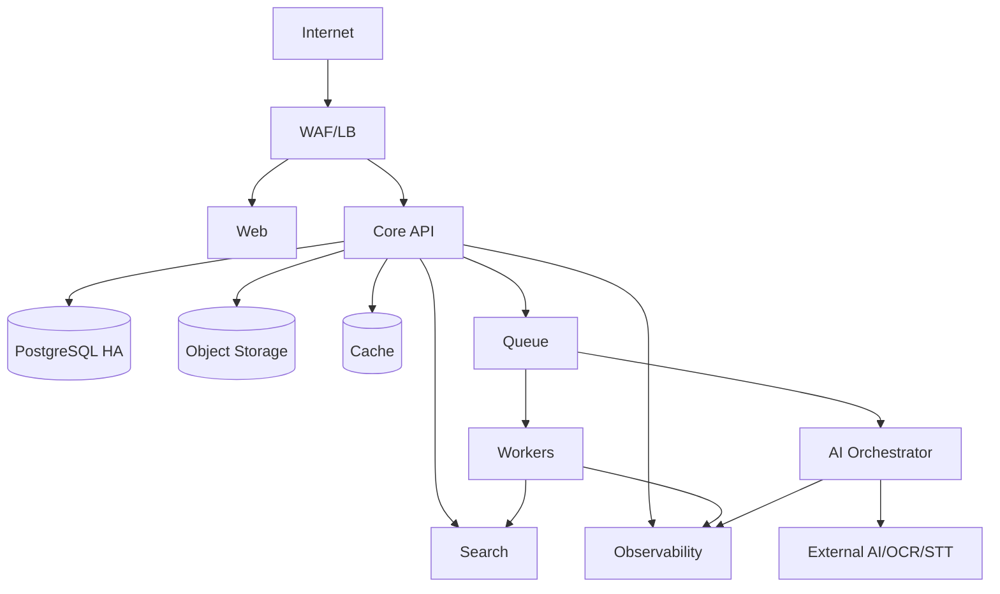
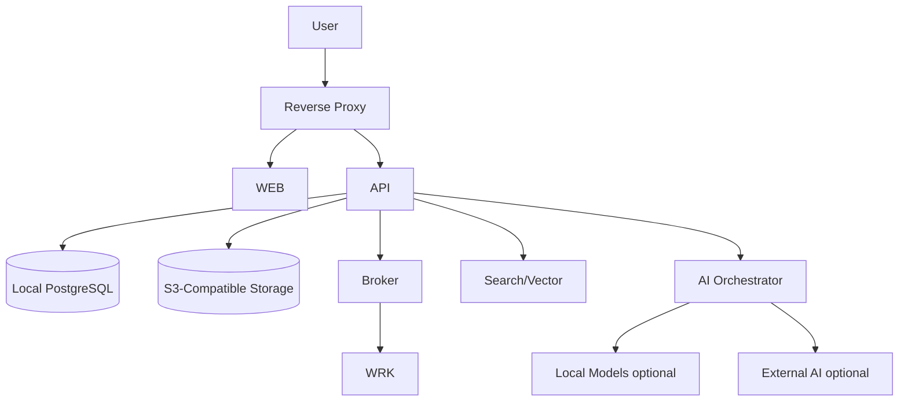

# VWork – Deployment Architecture v1.0

**Mục tiêu:** Mô tả mô hình triển khai VWork cho SaaS, Private và On-Premise với cùng core codebase.

---

# 1. Deployment Principles

- immutable/reproducible artifacts.
- configuration externalized.
- secrets externalized.
- environment isolation.
- same image/code across profiles.
- observability built-in.
- backup/restore designed.
- AI/integration can be policy-controlled.

---

# 2. Runtime Components

- web
- core-api
- worker
- ai-orchestrator
- search-indexer
- notification-worker
- relational database
- object storage
- search engine
- vector store
- queue/message broker
- cache
- reverse proxy/load balancer
- monitoring/logging
- secret manager

Optional:
- OCR local engine
- STT local engine
- model gateway/local LLM

---

# 3. SaaS Topology



Recommended:
- >=2 API replicas production.
- workers autoscale by queue.
- managed DB HA if cloud.
- object storage versioning.
- private data services.

---

# 4. Private Cloud

Dedicated:
- namespace/project/VPC.
- app runtimes.
- optional DB/storage/search dedicated.
- customer-specific network/integration.

Same container images.

No fork.

---

# 5. On-Premise



Dependencies phải có supported matrix.

---

# 6. Environment Matrix

LOCAL:
- docker compose/dev services.
- synthetic data.

DEV:
- shared engineering env.

TEST:
- automated integration.

STAGING:
- production-like.
- qualification.

PRODUCTION:
- restricted access.
- approved deployment.

Không copy raw production DB sang non-prod.

---

# 7. Container Images

Images:
- vwork-web
- vwork-core-api
- vwork-worker
- vwork-ai-orchestrator
- vwork-search-indexer
- vwork-notification-worker

Tag:
- semantic version + git sha.

Image must:
- non-root.
- read-only filesystem where feasible.
- health endpoint.
- pinned base digest.
- SBOM.

---

# 8. Configuration

Config groups:
- runtime.
- DB.
- storage.
- queue.
- search/vector.
- auth.
- AI routing.
- feature flags.
- retention.
- integration.

No secrets in ordinary config maps.

---

# 9. Feature Flags

Use for:
- gradual rollout.
- tenant enablement.
- experimental AI feature.
- provider switch.

Không dùng feature flag để bypass security rule.

Flags versioned/audited for tenant-impacting changes.

---

# 10. Networking

Public ingress:
- 443 only baseline.

Internal:
- service-to-service private.
- DB/search/storage private.

Egress:
- provider allowlist.
- proxy/NAT.
- on-prem can disable external AI.

---

# 11. High Availability

SaaS target:
- API replicas.
- stateless.
- DB HA.
- queue durable.
- worker replaceable.
- storage durable.

Search outage degrades search/RAG but core remains.

---

# 12. Scaling

API: CPU/RPS.

Worker: queue depth/oldest age.

AI orchestrator: concurrent request/provider quota.

Search: index volume/query.

DB: connections/query/IO.

Object: storage bytes/request.

---

# 13. Backup

DB:
- scheduled full.
- WAL/PITR if tier.
- encrypted.

Object:
- versioning/lifecycle.

Config:
- Git/IaC.
- secret recovery policy.

Search/vector:
- snapshot or rebuild strategy.

---

# 14. DR

Document:
- dependency order.
- restore DB.
- restore/object verify.
- restore queue state strategy.
- rebuild search/vector.
- smoke critical flow.

RPO/RTO baseline follows NFR.

---

# 15. CI/CD

```text
Commit
→ Lint
→ Unit
→ SAST/Secret/Dependency
→ Migration Check
→ OpenAPI Lint
→ Build
→ SBOM/Image Scan
→ Integration/Contract
→ Deploy Test
→ E2E
→ Promote Staging
→ Performance/Security/AI Qualification
→ Approval
→ Production
```

---

# 16. Deployment Strategy

Baseline:
- rolling update for stateless.
- blue/green optional for high-risk.
- migration expand/contract.

Order:
1. backward-compatible DB migration.
2. backend.
3. worker.
4. web/mobile release.
5. cleanup migration later.

---

# 17. Rollback

Application rollback only if DB backward compatible.

If migration destructive:
- no automatic rollback without restore/migration plan.

Every release has:
- rollback decision criteria.
- previous image digest.
- migration compatibility note.

---

# 18. Observability Stack

Metrics:
Prometheus-compatible.

Logs:
centralized structured.

Tracing:
OpenTelemetry.

Dashboards:
- API.
- jobs.
- AI.
- DB.
- queue.
- search.
- tenant consumption.

Alerts:
- error rate.
- latency.
- queue backlog.
- dead-letter.
- DB saturation.
- provider outage.
- storage error.

---

# 19. Operational Health

/health/live:
process alive.

/health/ready:
DB + critical dependencies needed for request serving.

Không require optional AI provider để core readiness fail nếu degradation acceptable.

---

# 20. Sizing Baseline

Pilot small tenant:
- API 2 vCPU / 4GB.
- worker 2 vCPU / 4GB.
- AI orchestrator 2 vCPU / 4GB excluding local models.
- DB 4 vCPU / 8GB.
- search 4 vCPU / 8GB.
- storage based on files.

Đây chỉ là baseline sơ bộ; phải benchmark bằng workload thực.

---

# 21. On-Premise Package

Bàn giao:
- container images.
- deployment manifests.
- env template.
- secret checklist.
- port matrix.
- sizing guide.
- install guide.
- upgrade guide.
- backup/restore.
- monitoring.
- license/entitlement config.

---

# 22. Air-Gapped Variant

Nếu khách hàng cấm outbound:
- local OCR/STT.
- local embedding.
- local LLM hoặc AI feature disabled.
- offline model package update controlled.
- no external telemetry.

---

# 23. Deployment Acceptance

PASS khi:
- install from clean environment.
- health.
- migration.
- login.
- upload/document.
- task/workflow.
- AI path theo profile.
- backup.
- restore.
- observability.
- security ports.
- rolling upgrade/rollback tested.
