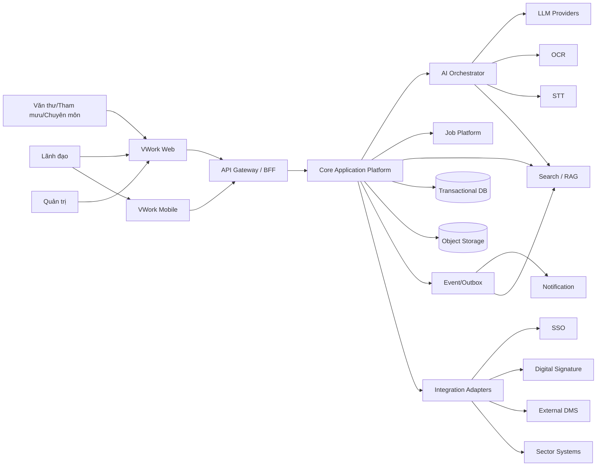
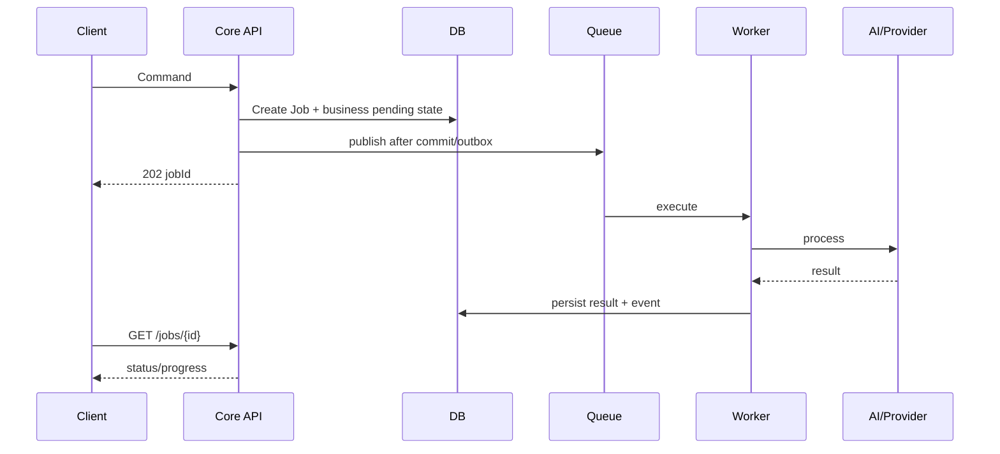
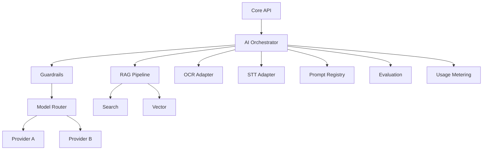

# VWork – System Architecture v1.0

**Mục tiêu:** Xác định kiến trúc hệ thống VWork Core v1 ở mức logical/deployment-neutral, đáp ứng SaaS, Private và On-Premise từ một core codebase.

## 1. Architecture Drivers

1. Multi-tenant isolation.
2. API-first cho Web/Mobile/integration.
3. AI là lớp hỗ trợ, không được nằm trong trusted authorization boundary.
4. Long-running OCR/STT/LLM/report job phải async.
5. Versioning + audit + provenance là yêu cầu nền.
6. SaaS/Private/On-Premise dùng cùng domain code.
7. Có graceful degradation khi AI/integration ngoài lỗi.
8. Có traceability từ requirement tới service/API/data/test.

## 2. Context Diagram

## 3. Logical Layers

### L1 Client
- Web App.
- Mobile App.
- Future external portal/client.

### L2 Edge
- API Gateway.
- Authentication handoff.
- Rate limit.
- Correlation ID.
- Optional BFF aggregation.

### L3 Application Services
- Identity/Organization.
- Document.
- Intelligence Coordinator.
- Draft/Review.
- Incoming.
- Work.
- Workflow.
- Meeting.
- Reporting.
- Knowledge.
- Executive.
- Governance.

### L4 AI Platform
- AI Gateway.
- Model/Provider Registry.
- Prompt Registry.
- RAG Orchestrator.
- OCR/STT adapters.
- Evaluation.
- Guardrails.
- Usage Metering.

### L5 Data & Platform
- PostgreSQL.
- Object Storage.
- Search engine.
- Vector index.
- Queue.
- Cache.
- Audit store/log pipeline.

### L6 Integration
- SSO adapter.
- Digital-signature adapter.
- DMS adapter.
- Sector adapter.
- Notification adapter.

## 4. Service Decomposition

VWork Core v1 ưu tiên **modular monolith + isolated workers** ở giai đoạn đầu, với boundary đủ rõ để tách service khi scale yêu cầu.

Lý do:
- domain nghiệp vụ nhiều nhưng transaction liên quan chặt;
- đội phát triển có thể vận hành đơn giản hơn;
- tránh distributed transaction quá sớm;
- vẫn tách AI/job/search/integration vì đặc tính tải và failure mode khác.

### Runtime components đề xuất

1. **core-api**
   - REST API.
   - domain/application services.
   - transaction DB.
   - authorization.
   - outbox.

2. **worker**
   - async business jobs.
   - export.
   - report extraction/aggregation.
   - scheduled reminders/escalations.

3. **ai-orchestrator**
   - LLM/OCR/STT/RAG.
   - provider abstraction.
   - prompt policy.
   - evaluation/guardrails.

4. **search-indexer**
   - consume outbox/event.
   - update full-text/vector index.

5. **notification-worker**
   - in-app/push/email adapter.

6. **web**
7. **mobile**

## 5. Trusted Boundaries

### TB-01 Client Boundary
Client không được tin cậy để enforce:
- tenant;
- role;
- data scope;
- workflow state.

### TB-02 Core Authorization Boundary
Core API là authoritative enforcement point cho business resource access.

### TB-03 AI Boundary
AI Orchestrator không tự cấp quyền. Core gửi approved context; RAG vẫn filter tenant/data scope.

### TB-04 External Integration Boundary
Mọi external input được validate, normalize và audit.

## 6. Multi-tenancy

### SaaS baseline
- Shared app runtime.
- Shared DB logical tenancy theo tenant_id.
- Shared object storage với opaque tenant namespace.
- Shared search/vector index có tenant filter.
- Có thể nâng tenant lớn sang dedicated DB/storage profile nếu cần.

### Private
- Dedicated runtime hoặc namespace.
- DB/storage riêng tùy hợp đồng.

### On-Premise
- Dedicated deployment.
- External AI có thể bật/tắt theo policy.

## 7. Data Architecture

System of record:
- PostgreSQL transactional DB.

Binary:
- Object Storage.

Search:
- Search engine full-text.
- Vector index cho semantic retrieval.

Cache:
- Redis/compatible, không lưu authoritative state.

Audit:
- Transactional audit event + export/log pipeline.

## 8. Async Architecture

Requirement:
- outbox hoặc cơ chế atomic tương đương.
- idempotency.
- retry transient.
- dead-letter.
- cancellation khi use case hỗ trợ.

## 9. AI Architecture

AI Request Envelope:
- tenant_id
- user/membership
- data_scope snapshot
- use_case_code
- source refs
- prompt version
- policy version
- correlation id

Không gửi toàn bộ tenant data sang provider.

## 10. Security Architecture

Controls:
- OIDC/session.
- RBAC + DataScope + ObjectPermission.
- TLS.
- encrypted storage/backup.
- malware scan.
- secret manager.
- presigned object URLs thời hạn ngắn.
- CSP/secure headers Web.
- secure mobile storage.
- prompt injection filtering.
- audit privileged access.
- dependency/SAST/secret scanning.

Authorization flow:
1. Authenticate identity.
2. Resolve membership/tenant.
3. Resolve resource.
4. Verify tenant.
5. Evaluate role/action.
6. Evaluate data scope.
7. Evaluate object policy.
8. Evaluate business state.
9. Execute.
10. Audit.

## 11. Observability

Mỗi request/job có correlation_id.

Telemetry:
- API latency/error.
- DB pool/query.
- queue depth/age.
- job duration/retry/failure.
- AI latency/usage/error.
- search latency.
- storage error.
- authz deny count.
- tenant resource consumption.

Logs phải structured và redact dữ liệu nhạy cảm.

## 12. Availability & Failure Modes

### AI provider down
- Core CRUD/workflow vẫn hoạt động.
- AI action chuyển PROVIDER_UNAVAILABLE/retry.
- UI hiển thị degraded state.

### Search down
- Core direct lookup vẫn hoạt động.
- Semantic search degraded.

### Queue down
- Command lưu pending/outbox; không báo thành công processing nếu chưa enqueue recoverable.

### Object storage down
- Upload/download fail rõ; DB không ghi final file state sai.

## 13. Deployment Profiles

### SaaS
Internet/LB → Web/API → core/worker/AI → managed DB/storage/search/queue.

### Private Cloud
Dedicated VPC/project/namespace; optional dedicated AI routing.

### On-Premise
Reverse proxy → containerized services → local DB/storage/search/queue; outbound AI optional.

## 14. Environment

- local
- dev
- test
- staging
- production

Không dùng production data trực tiếp ở non-prod nếu chưa masking và phê duyệt.

## 15. CI/CD Architecture

Pipeline:
1. dependency install locked.
2. lint/static analysis.
3. unit.
4. migration validation.
5. OpenAPI lint/contract.
6. integration.
7. security scan.
8. build artifact.
9. deploy test/staging.
10. smoke.
11. performance/security/e2e gates tùy branch/release.
12. promote signed/versioned artifact.

## 16. Architecture Decisions cần ADR

- ADR-001 Modular Monolith baseline.
- ADR-002 PostgreSQL primary store.
- ADR-003 Object storage abstraction.
- ADR-004 Search/vector strategy.
- ADR-005 Async job/outbox.
- ADR-006 AI Provider abstraction.
- ADR-007 Multi-tenant isolation model.
- ADR-008 Web editor technology.
- ADR-009 Mobile framework.
- ADR-010 Workflow engine build vs library.

## 17. Exit Criteria

- 124 FR có component owner.
- 94 NFR có architecture response.
- không có trusted authorization ở client/AI.
- async flow có recovery.
- deployment 3 profile khả thi từ same codebase.
- data/provenance/audit boundary rõ.
