# VWork Golden Image Pack

Đây là **visual source of truth** cho UI VWork v2. Claude/Codex phải đọc cùng:
- VWORK-GOLDEN-SCREEN-CATALOG-v1.0.md
- VWORK-VISUAL-DESIGN-REFERENCE-PACK-v1.0.md
- VWORK-CLAUDE-CODEX-UI-HANDOFF-v2.0.md

## Batch 01 — Approved style baseline

| Golden Screen | File | Purpose |
|---|---|---|
| GS-WEB-01 | GS-WEB-01-home-service-launcher.webp | Home / Service Launcher — style anchor |
| GS-WEB-02 | GS-WEB-02-unified-work-inbox.webp | Việc của tôi / Unified Work Inbox |
| GS-WEB-04 | GS-WEB-04-tham-muu-van-ban.webp | Tham mưu văn bản workspace |
| GS-WEB-05 | GS-WEB-05-hoan-thien-van-ban.webp | Hoàn thiện / rà soát văn bản |
| GS-WEB-06 | GS-WEB-06-xu-ly-van-ban-den.webp | Xử lý văn bản đến |

## Implementation rules

1. **GS-WEB-01 is the shell/style anchor.**
2. Reuse the same AppShell, typography, spacing, cards, buttons, source badges, AI patterns and navigation.
3. Do not create per-module themes.
4. External/integrated records must preserve source ownership cues.
5. Business/security specs override mockup if any generated text is inconsistent with canonical requirements.
6. These images define composition/style; Screen Specs define behavior/state/permission/API.

## Images

### GS-WEB-01 — Home / Service Launcher
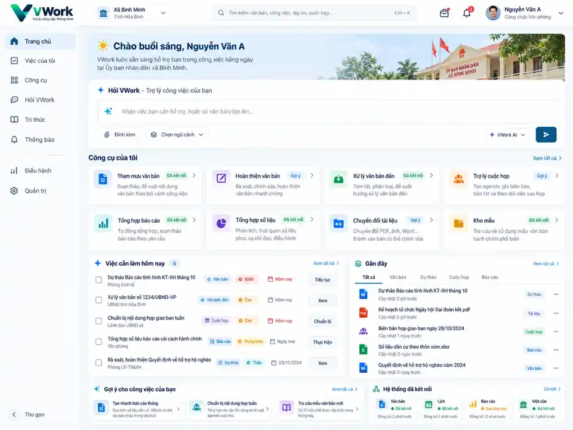

### GS-WEB-02 — Việc của tôi / Unified Work Inbox
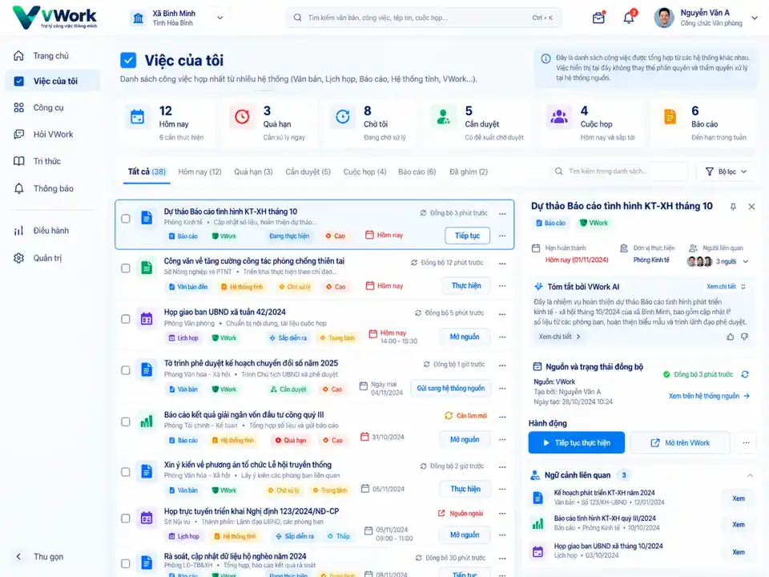

### GS-WEB-04 — Tham mưu văn bản
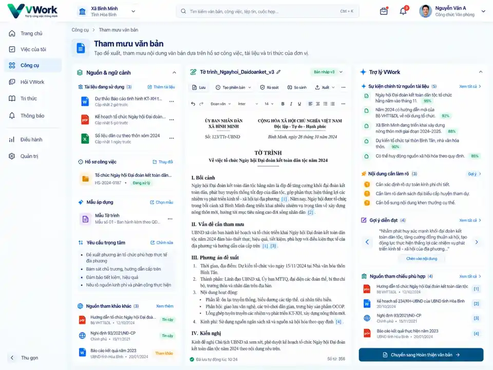

### GS-WEB-05 — Hoàn thiện văn bản
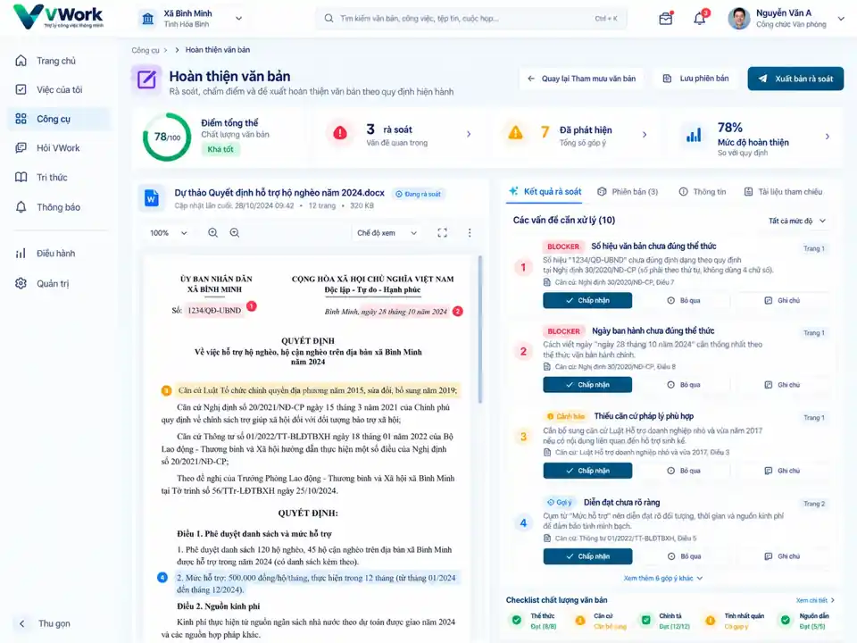

### GS-WEB-06 — Xử lý văn bản đến
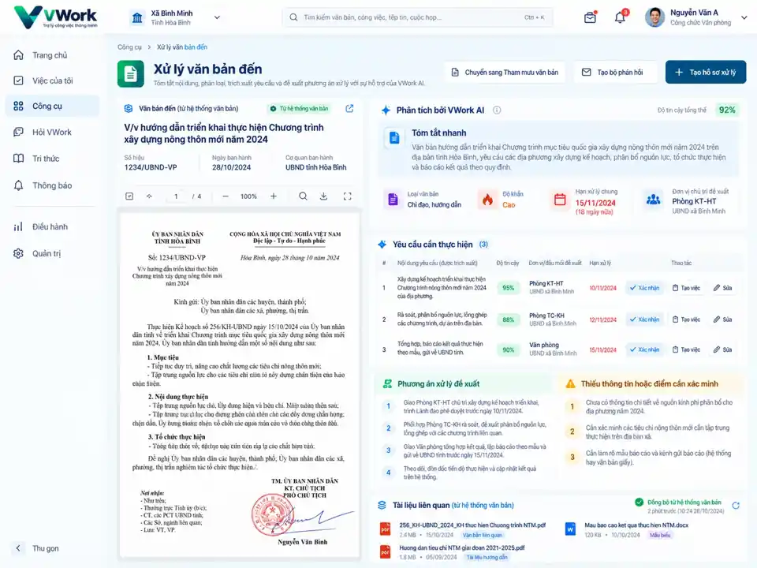

## Batch 02 — Meeting / Reporting / Ask / Knowledge / Leader / Admin

| Golden Screen | File | Purpose |
|---|---|---|
| GS-WEB-07 | GS-WEB-07-tro-ly-cuoc-hop.webp | Trợ lý cuộc họp |
| GS-WEB-08 | GS-WEB-08-tong-hop-bao-cao.webp | Tổng hợp báo cáo |
| GS-WEB-09 | GS-WEB-09-hoi-vwork.webp | Hỏi VWork |
| GS-WEB-10 | GS-WEB-10-kho-mau-tri-thuc.webp | Kho mẫu & Tri thức |
| GS-WEB-11 | GS-WEB-11-dieu-hanh-daily-brief.webp | Điều hành / Daily Brief |
| GS-WEB-12 | GS-WEB-12-quan-tri-tich-hop-che-do.webp | Quản trị tích hợp & chế độ |

### GS-WEB-07 — Trợ lý cuộc họp
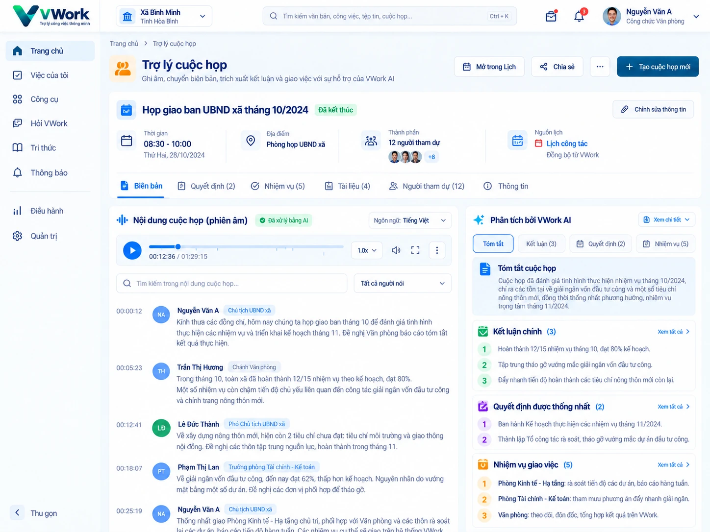

### GS-WEB-08 — Tổng hợp báo cáo
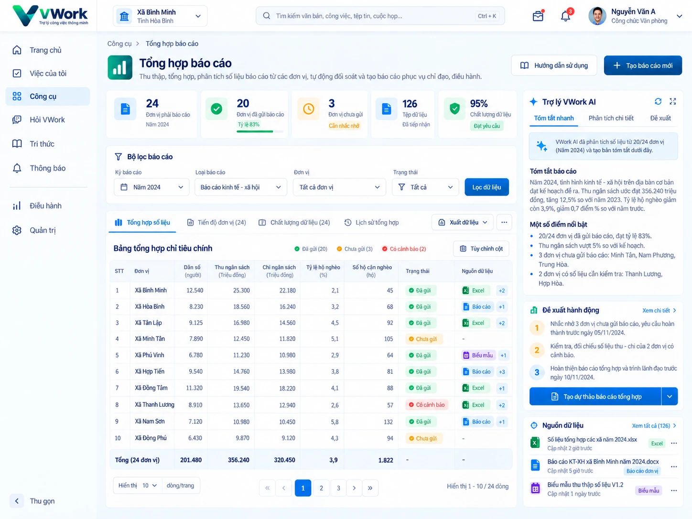

### GS-WEB-09 — Hỏi VWork
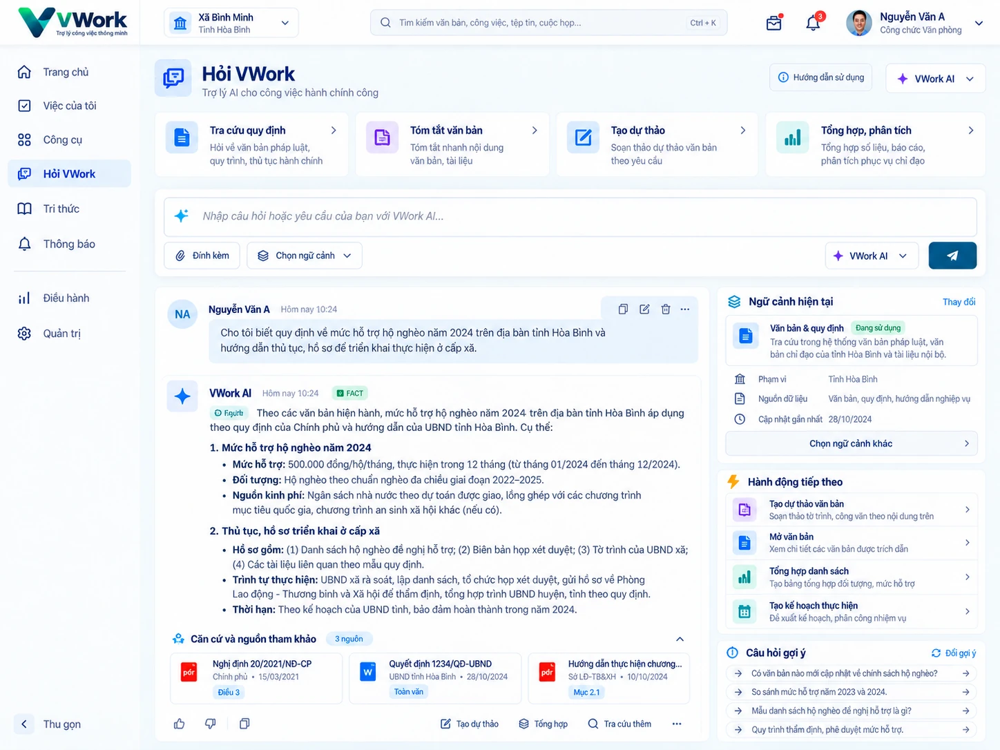

### GS-WEB-10 — Kho mẫu & Tri thức
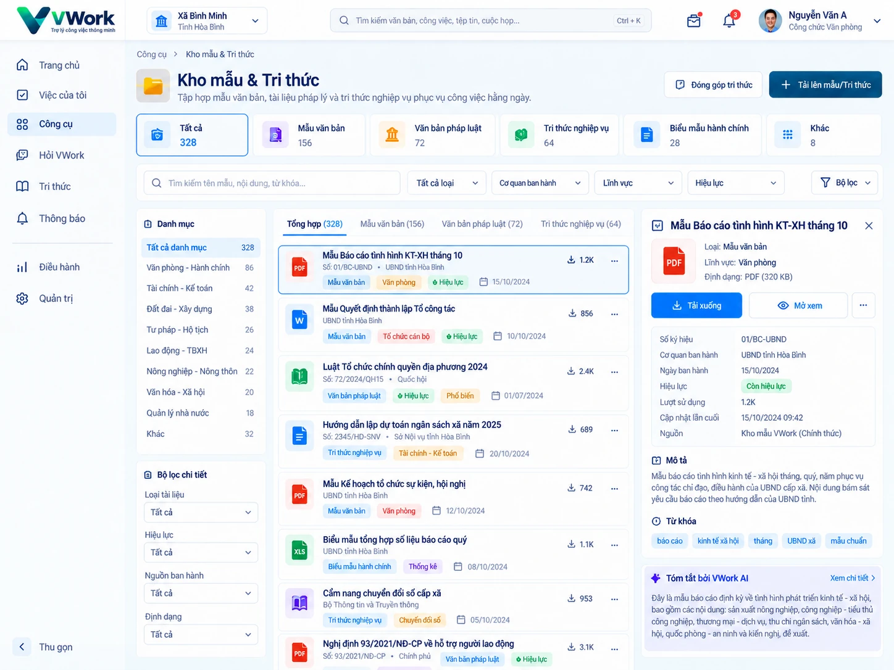

### GS-WEB-11 — Điều hành / Daily Brief
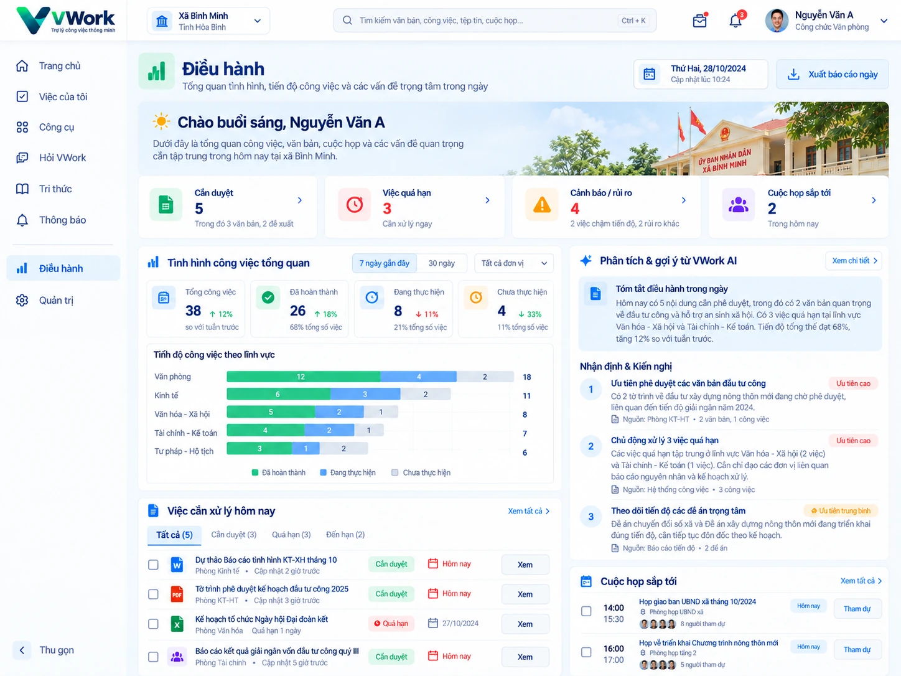

### GS-WEB-12 — Quản trị tích hợp & chế độ
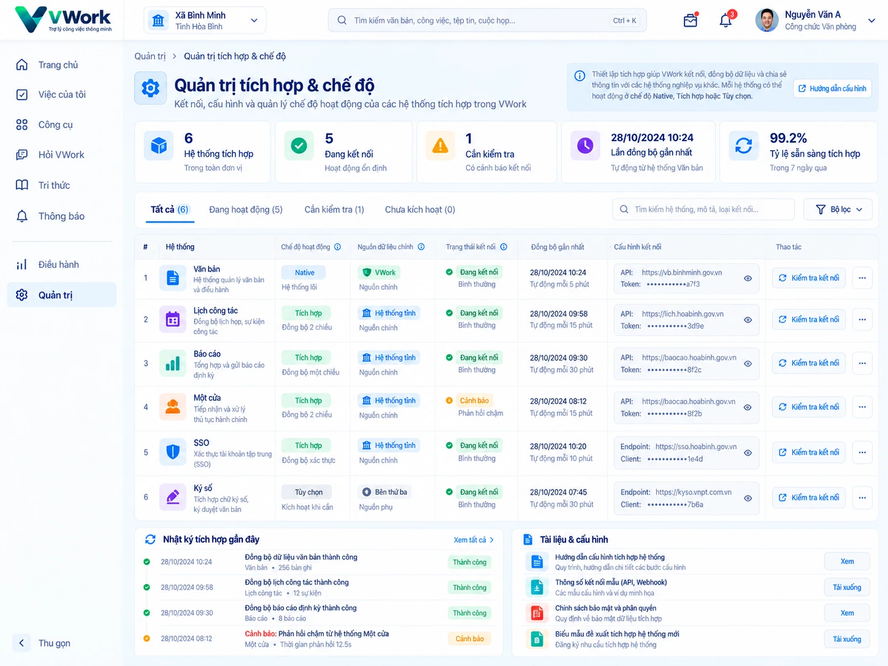

**Batch 02 commit:** `21233f6c14133e4f8ade947c6ad7b83fddf141c7`

## Mobile Golden Image Pack

| Golden Screen | File | Purpose |
|---|---|---|
| GS-MOB-01 | GS-MOB-01-home-service-launcher.webp | Home / Service Launcher |
| GS-MOB-02 | GS-MOB-02-unified-work-inbox.webp | Việc của tôi / Unified Work Inbox |
| GS-MOB-03 | GS-MOB-03-hoi-vwork.webp | Hỏi VWork |
| GS-MOB-04 | GS-MOB-04-review-approval.webp | Review / Approval |
| GS-MOB-05 | GS-MOB-05-tro-ly-cuoc-hop.webp | Trợ lý cuộc họp |
| GS-MOB-06 | GS-MOB-06-mobile-tool-launcher.webp | Mobile Tool Launcher |

Contact sheet:
- GS-MOB-00-mobile-golden-pack-contact-sheet.webp

### Mobile implementation rules
1. Bottom navigation tối đa 5 mục: Trang chủ / Việc / Hỏi VWork / Công cụ / Tôi.
2. Giữ cùng visual language với Web Golden Pack: navy/deep blue + cyan/teal + light surfaces.
3. Source badge, citation, AI state, connector state phải dùng cùng semantic với Web.
4. Mobile ưu tiên completion flow; không ép desktop table/admin layout xuống màn nhỏ.
5. GS-MOB-01 là mobile shell anchor; GS-MOB-03 khóa pattern assistant/citation; GS-MOB-04 khóa sticky action CTA.
6. Business/security specs override mockup nếu copy minh họa khác canonical behavior.

### Images
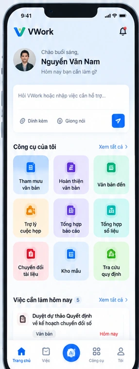
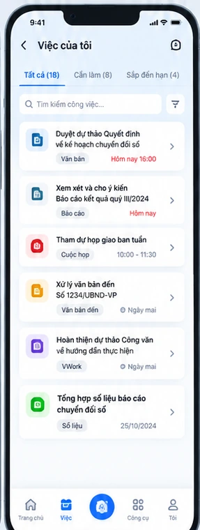
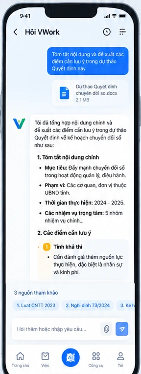
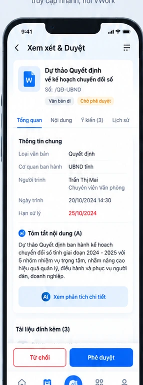
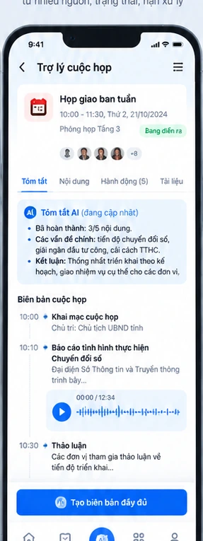
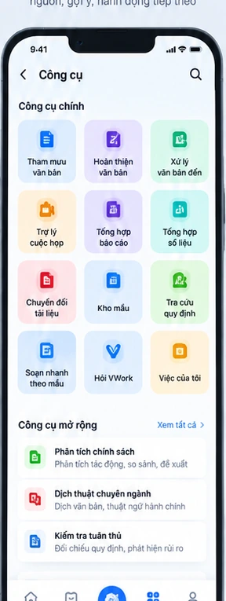
