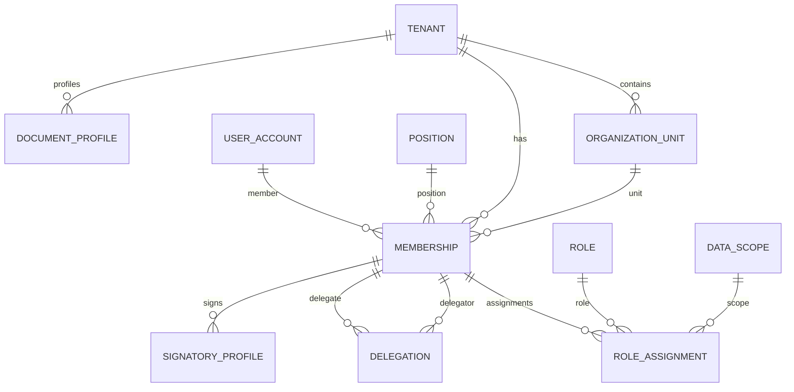
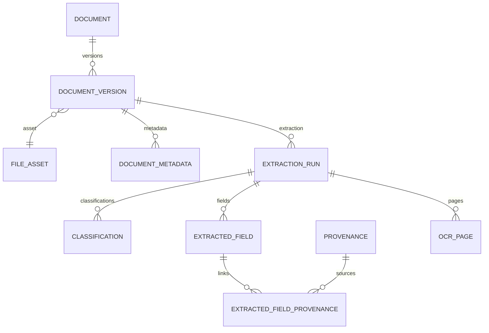
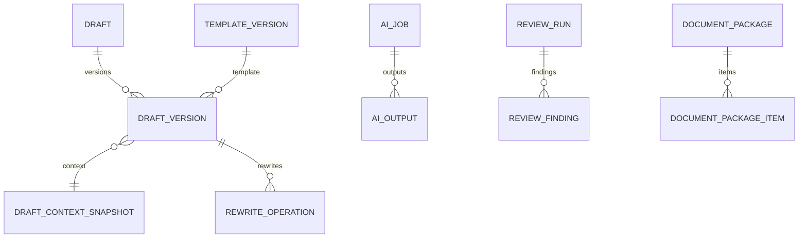
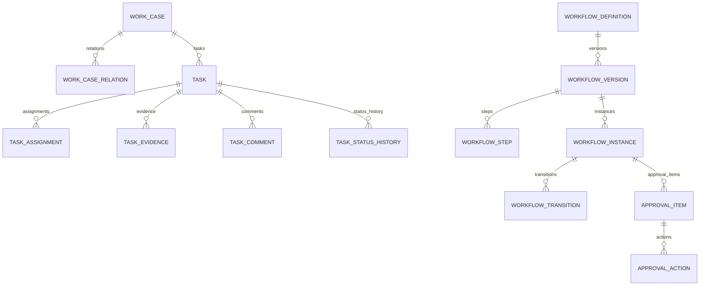
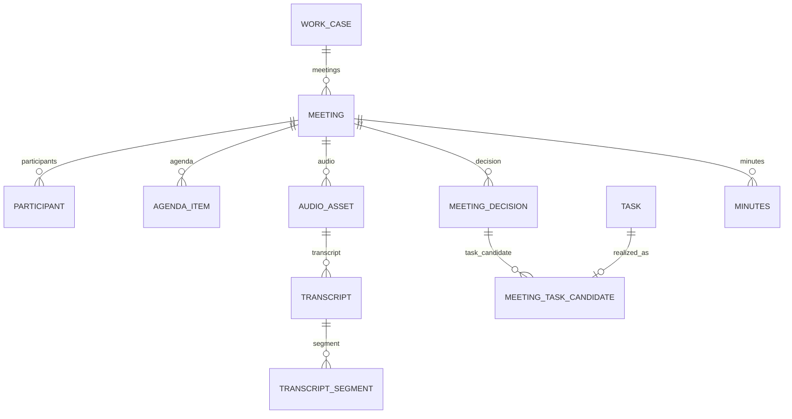
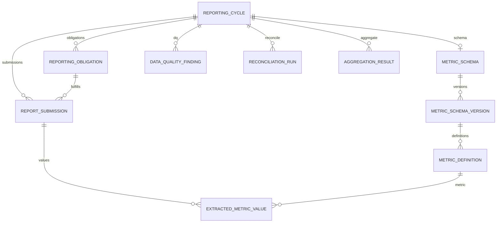
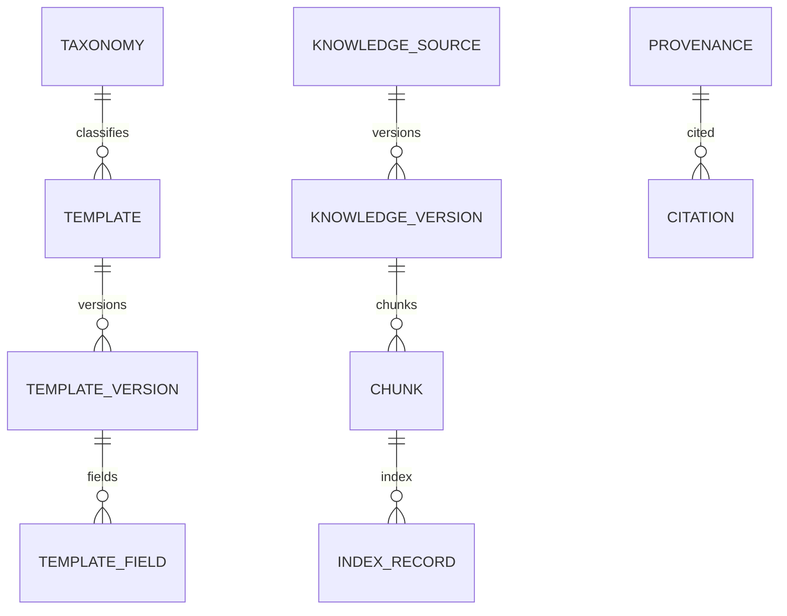

# VWork – ERD v1.0

**Mục tiêu:** Mô tả quan hệ dữ liệu logic giữa các aggregate/table chính. Đây là logical ERD; physical design, partition và index chi tiết sẽ được bổ sung trong Database Design.

## 1. ERD tổng thể

```mermaid
erDiagram
  TENANT ||--o{ ORGANIZATION_UNIT : contains
  TENANT ||--o{ MEMBERSHIP : has
  USER_ACCOUNT ||--o{ MEMBERSHIP : joins
  ORGANIZATION_UNIT ||--o{ MEMBERSHIP : includes
  MEMBERSHIP ||--o{ ROLE_ASSIGNMENT : receives
  ROLE ||--o{ ROLE_ASSIGNMENT : assigned
  DATA_SCOPE ||--o{ ROLE_ASSIGNMENT : limits

  TENANT ||--o{ DOCUMENT : owns
  DOCUMENT ||--o{ DOCUMENT_VERSION : versions
  DOCUMENT_VERSION }o--|| FILE_ASSET : uses
  DOCUMENT_VERSION ||--o{ DOCUMENT_METADATA : has

  DOCUMENT_VERSION ||--o{ EXTRACTION_RUN : processed
  EXTRACTION_RUN ||--o{ EXTRACTED_FIELD : outputs
  EXTRACTED_FIELD }o--o{ PROVENANCE : grounded_by

  TENANT ||--o{ DRAFT : owns
  DRAFT ||--o{ DRAFT_VERSION : versions
  REVIEW_RUN ||--o{ REVIEW_FINDING : produces

  DOCUMENT ||--o| INCOMING_RECORD : registered_as
  INCOMING_RECORD ||--o{ INCOMING_REQUIREMENT : contains
  INCOMING_RECORD }o--o| WORK_CASE : creates

  TENANT ||--o{ WORK_CASE : owns
  WORK_CASE ||--o{ TASK : contains
  TASK ||--o{ TASK_ASSIGNMENT : assignments
  TASK ||--o{ TASK_EVIDENCE : evidence

  WORKFLOW_DEFINITION ||--o{ WORKFLOW_VERSION : versions
  WORKFLOW_VERSION ||--o{ WORKFLOW_INSTANCE : instantiates
  WORKFLOW_INSTANCE ||--o{ APPROVAL_ITEM : approvals
  APPROVAL_ITEM ||--o{ APPROVAL_ACTION : actions

  WORK_CASE ||--o{ MEETING : related
  MEETING ||--o{ TRANSCRIPT : transcript
  TRANSCRIPT ||--o{ TRANSCRIPT_SEGMENT : segments
  MEETING ||--o{ MEETING_DECISION : decisions

  REPORTING_CYCLE ||--o{ REPORTING_OBLIGATION : obligations
  REPORTING_CYCLE ||--o{ REPORT_SUBMISSION : submissions
  METRIC_SCHEMA ||--o{ METRIC_SCHEMA_VERSION : versions
  METRIC_SCHEMA_VERSION ||--o{ METRIC_DEFINITION : metrics
  REPORT_SUBMISSION ||--o{ EXTRACTED_METRIC_VALUE : values

  TEMPLATE ||--o{ TEMPLATE_VERSION : versions
  KNOWLEDGE_SOURCE ||--o{ KNOWLEDGE_VERSION : versions
  KNOWLEDGE_VERSION ||--o{ CHUNK : chunks

  EXECUTIVE_BRIEF ||--o{ BRIEF_ITEM : items
  ASSISTANT_CONVERSATION ||--o{ ASSISTANT_MESSAGE : messages

  AI_PROVIDER ||--o{ AI_MODEL : models
  PROMPT_TEMPLATE ||--o{ PROMPT_VERSION : versions
  JOB ||--o{ JOB_ATTEMPT : attempts
```

## 2. Identity & Organization

Ràng buộc:
- OrganizationUnit.parent_id phải cùng tenant.
- RoleAssignment chỉ hợp lệ trong thời gian Membership active.
- Delegation không được làm tăng đặc quyền.
- SignatoryProfile phải thuộc Membership cùng tenant.

## 3. Document & Intelligence

Nguyên tắc:
- Một Document có nhiều Version.
- Mỗi ExtractionRun xử lý đúng một DocumentVersion.
- ExtractedField có thể có nhiều Provenance.
- Provenance được dùng lại cho review, báo cáo và decision.

## 4. Draft & Review

## 5. Work & Workflow

Invariant:
- WorkCase không đóng nếu còn blocking Task active.
- WorkflowInstance pin một WorkflowVersion.
- ApprovalItem pin đúng submitted version.

## 6. Meeting

## 7. Reporting

## 8. Knowledge

## 9. Physical Design Guidance

### Transactional DB
- PostgreSQL hoặc tương đương.
- UUID/ULID thống nhất trước migration đầu tiên.
- JSONB chỉ dùng cho cấu hình linh hoạt; dữ liệu cần query/report phải typed.
- Có thể dùng RLS như defense-in-depth, không thay service authorization.
- Cân nhắc partition AuditEvent, Job, UsageRecord khi volume lớn.

### Object Storage
- S3-compatible abstraction.
- Key dùng opaque tenant namespace.
- Filename người dùng không phải security boundary.

### Search/RAG
- Index bắt buộc chứa tenant_id và access-scope metadata.
- Filter scope trước rerank.
- Vector index phải lưu source version để citation không trỏ nhầm version.

## 10. Exit Criteria
- Mọi entity Domain Model có storage strategy.
- Không có FK cross-tenant trái phép.
- Versioned entity không overwrite.
- Provenance cover document/table/audio.
- Workflow và Metric Schema pin version.
- Bảng P0 có index plan ở Database Design.
